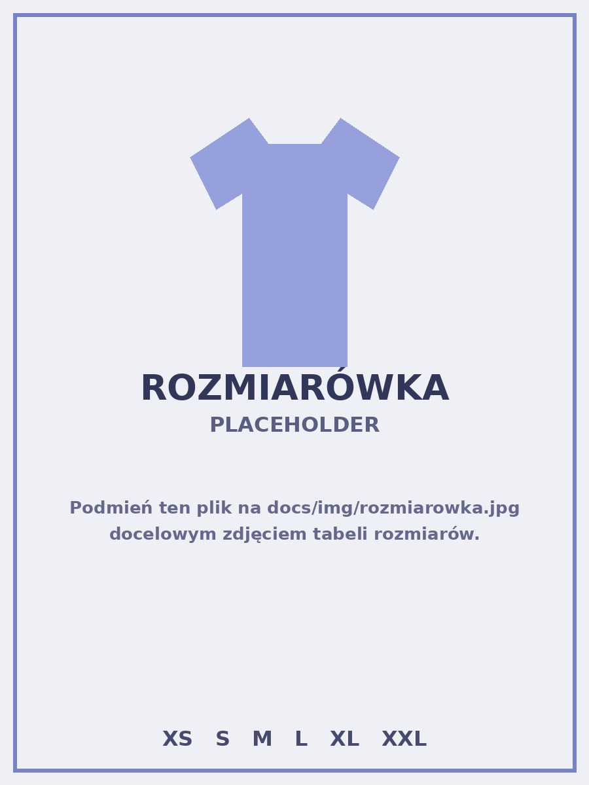

# Zgłoszenie danych do stroju

Wypełnij poniższy formularz, aby zgłosić dane do nowego stroju sportowego.

<form id="zgloszenie-form" class="stroj-form" novalidate>

  

    <label for="nazwisko">Nazwisko *</label>
    <input type="text" id="nazwisko" name="nazwisko" autocomplete="family-name" required>
  

  

    <label for="imie">Imię *</label>
    <input type="text" id="imie" name="imie" autocomplete="given-name" required>
  

  

    <label for="rozmiar">Rozmiar stroju *</label>
    <select id="rozmiar" name="rozmiar" required>
      <option value="" disabled selected>Wybierz rozmiar</option>
      <option value="XS">XS</option>
      <option value="S">S</option>
      <option value="M">M</option>
      <option value="L">L</option>
      <option value="XL">XL</option>
      <option value="XXL">XXL</option>
    </select>
  

  

    <label for="numer">Numer zawodnika *</label>
    <input type="number" id="numer" name="numer" inputmode="numeric" min="0" step="1" required>
  

  

    
    Stuknij, aby powiększyć tabelę rozmiarów
  

  

    <label for="uwagi">Uwagi (opcjonalne)</label>
    <textarea id="uwagi" name="uwagi" placeholder="Np. dodatkowe informacje dotyczące zamówienia"></textarea>
  

  <button type="submit" id="zgloszenie-submit" class="stroj-btn">Zatwierdź</button>

</form>

  <button id="rozmiarowka-close" class="lightbox-close" type="button" aria-label="Zamknij">✕</button>
  

  

    
✓

    <h2 id="app-modal-title">Tytuł</h2>
    
Treść.

    <button id="app-modal-close" type="button" class="stroj-btn">OK</button>
  

