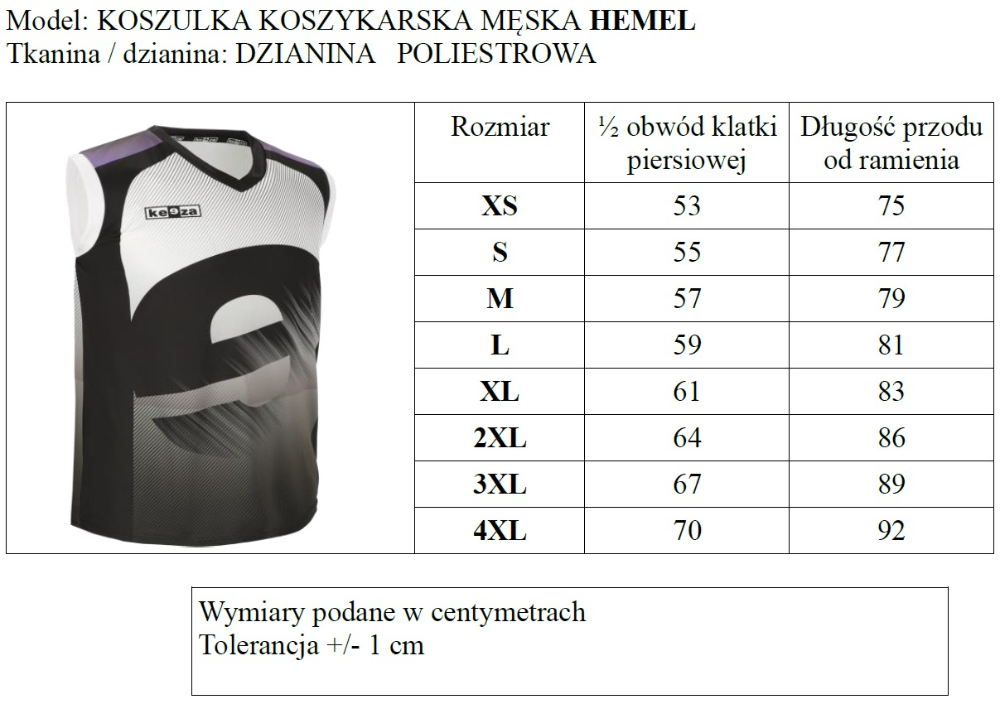
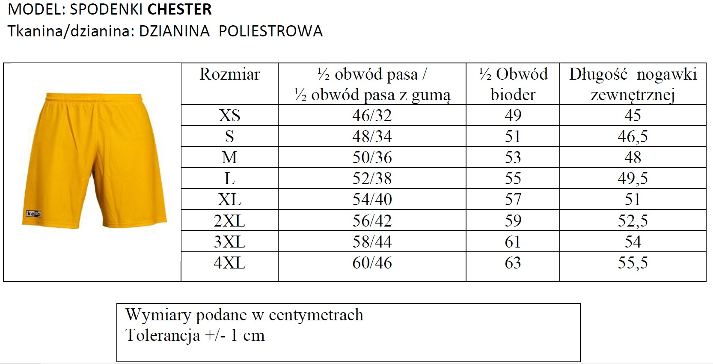

# Nowe stroje dla U15

Wypełnij poniższy formularz, aby zgłosić dane do nowego stroju sportowego.

  
Cena za dwa komplety strojów meczowych: <strong>290 zł</strong>

  <figure class="rozmiarowka-figura">
    
    <figcaption class="rozmiarowka-podpis">Rozmiary koszulek — stuknij, aby powiększyć</figcaption>
  </figure>

  <figure class="rozmiarowka-figura">
    
    <figcaption class="rozmiarowka-podpis">Rozmiary spodenek — stuknij, aby powiększyć</figcaption>
  </figure>

<form id="zgloszenie-form" class="stroj-form" novalidate>

  

    <label for="nazwisko">Nazwisko *</label>
    <input type="text" id="nazwisko" name="nazwisko" autocomplete="family-name" required>
  

  

    <label for="imie">Imię *</label>
    <input type="text" id="imie" name="imie" autocomplete="given-name" required>
  

  

    <label for="rozmiar-koszulki">Rozmiar koszulki *</label>
    <select id="rozmiar-koszulki" name="rozmiar-koszulki" required>
      <option value="" disabled selected>Wybierz rozmiar</option>
      <option value="XS">XS</option>
      <option value="S">S</option>
      <option value="M">M</option>
      <option value="L">L</option>
      <option value="XL">XL</option>
      <option value="2XL">2XL</option>
      <option value="3XL">3XL</option>
      <option value="4XL">4XL</option>
    </select>
  

  

    <label for="rozmiar-spodenek">Rozmiar spodenek *</label>
    <select id="rozmiar-spodenek" name="rozmiar-spodenek" required>
      <option value="" disabled selected>Wybierz rozmiar</option>
      <option value="XS">XS</option>
      <option value="S">S</option>
      <option value="M">M</option>
      <option value="L">L</option>
      <option value="XL">XL</option>
      <option value="2XL">2XL</option>
      <option value="3XL">3XL</option>
      <option value="4XL">4XL</option>
    </select>
  

  

    <label for="numer">Numer zawodnika *</label>
    <input type="number" id="numer" name="numer" inputmode="numeric" min="0" step="1" required>
  

  

    <label for="uwagi">Uwagi (opcjonalne)</label>
    <textarea id="uwagi" name="uwagi" placeholder="Np. dodatkowe informacje dotyczące zamówienia"></textarea>
  

  <button type="submit" id="zgloszenie-submit" class="stroj-btn">Zatwierdź</button>

</form>

  <button id="rozmiarowka-close" class="lightbox-close" type="button" aria-label="Zamknij">✕</button>
  

  

    
✓

    <h2 id="app-modal-title">Tytuł</h2>
    
Treść.

    <button id="app-modal-close" type="button" class="stroj-btn">OK</button>
  

